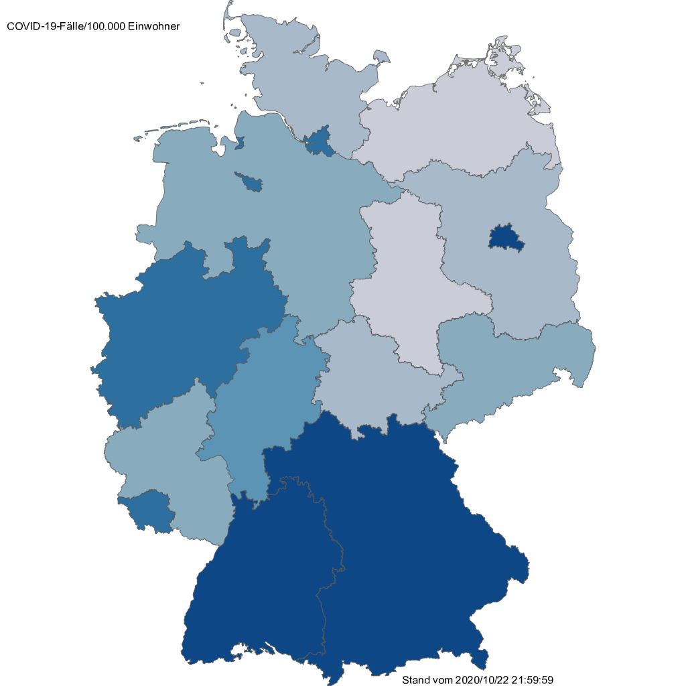
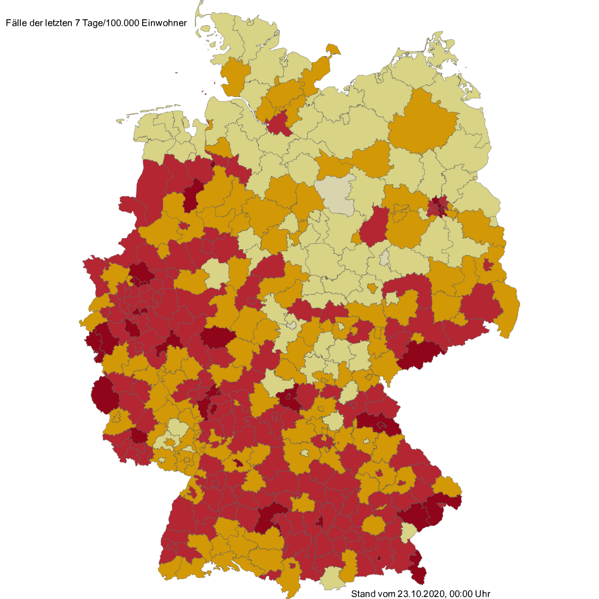

# Robert Koch-Institut API (Data & Images)

With this JSON API you can get the data of corona cases for every state and every district in Germany.
You have also access to the latest images of maps.

Data Sources:

https://npgeo-corona-npgeo-de.hub.arcgis.com/datasets/917fc37a709542548cc3be077a786c17_0?geometry=-21.159%2C46.211%2C43.177%2C55.839

https://npgeo-corona-npgeo-de.hub.arcgis.com/datasets/ef4b445a53c1406892257fe63129a8ea_0?geometry=-24.040%2C46.270%2C40.296%2C55.886

## Endpoints

### `https://rki.marlon-lueckert.de/api/general`

#### Data Structure

```json
{
  "lastUpdate": "18.11.2020, 00:00 Uhr",
  "recovered": 546503,
  "cases": 833307,
  "deaths": 13119,
  "weekIncidence": 89.32123,
  "casesPer100k":1658.4015207719349,
  "casesPerWeek":149552,
  "difference": {
    "recovered": 19628,
    "cases": 22268,
    "deaths": 389,
    "weekIncidence":	-7.8625208588566124,
    "casesPerWeek":	-6539,
    "casesPer100k":	27.004795223896735
  }
}
```

### `https://rki.marlon-lueckert.de/api/states`

#### Data Structure

```json
{
  "lastUpdate": 1603317600000,
  "states": [
    {
      "name": "Baden-Württemberg",
      "count": 58653,
      "weekIncidence": 42,
      "casesPer100k": 343.099136209832,
      "deaths": 1927,
      "code": "BW"
    },
    {
      "name": "Bayern",
      "count": 77904,
      "weekIncidence": 39,
      "casesPer100k": 123.099136209832,
      "deaths": 2714,
      "code": "BY"
    },
    ...
    {
      "name": "Schleswig-Holstein",
      "count": 5600,
      "weekIncidence": 13,
      "casesPer100k": 121.099136209832,
      "deaths": 163,
      "code": "SH"
    },
    {
      "name": "Thüringen",
      "count": 4793,
      "weekIncidence": 18,
      "casesPer100k": 324.099136209832,
      "deaths": 198,
      "code": "TH"
    }
  ]
}
```

### `https://rki.marlon-lueckert.de/api/states-map`

#### Parameter

- `transparent`: toggle transparency
- `theme`: choose `dark` for a white font color, choose `light` for a black font color

You receive a PNG image:



### `https://rki.marlon-lueckert.de/api/districts`

#### Data Structure

```json
{
  "lastUpdate": "26.10.2020, 00:00 Uhr",
  "districts": [
    {
      "name": "Flensburg",
      "county": "SK Flensburg",
      "count": 182,
      "deaths": 3,
      "weekIncidence": 34.3817931768777,
      "casesPer100k": 201.854398651346,
      "casesPerPopulation": 0.201854398651346
    },
    {
      "name": "Kiel",
      "county": "SK Flensburg",
      "count": 582,
      "deaths": 12,
      "weekIncidence": 27.5533440845401,
      "casesPer100k": 235.824209664741,
      "casesPerPopulation": 0.235824209664741
    },
    ...
    {
      "name": "Berlin Friedrichshain-Kreuzberg",
      "county": "SK Berlin Friedrichshain-Kreuzberg",
      "count": 2622,
      "deaths": 11,
      "weekIncidence": 172.304376034801,
      "casesPer100k": 929.592744780347,
      "casesPerPopulation": 0.929592744780347
    },
    {
      "name": "Berlin Tempelhof-Schöneberg",
      "county": "SK Berlin Tempelhof-Schöneberg",
      "count": 2760,
      "deaths": 28,
      "weekIncidence": 164.729702842831,
      "casesPer100k": 807.555914469295,
      "casesPerPopulation": 0.807555914469295
    }
  ]
}
```

### `https://rki.marlon-lueckert.de/api/districts-map`

#### Parameter

- `transparent`: toggle transparency
- `theme`: choose `dark` for a white font color, choose `light` for a black font color

You receive a PNG image:




## Project Showcase (projects using this API)

[Add your project by openening an issue with your project details!](https://github.com/marlon360/rki-covid-api/issues/new)

- CoronaBot Deutschland (https://twitter.com/CoronaBot_DEU)
- Fallzahlen Aktuell - Inzidenz & mehr aus DE
(https://play.google.com/store/apps/details?id=com.kokoschka.michael.casestoday&hl=de)
- Home Assistant Integration (https://github.com/thebino/rki_covid)

## License

<p xmlns:dct="http://purl.org/dc/terms/" xmlns:cc="http://creativecommons.org/ns#" class="license-text"><a rel="cc:attributionURL" property="dct:title" href="https://rki.marlon-lueckert.de">rki-covid-api</a> by <a rel="cc:attributionURL dct:creator" property="cc:attributionName" href="https://marlon-lueckert.de">Marlon Lückert</a> is licensed under <a rel="license" href="https://creativecommons.org/licenses/by/4.0">CC BY 4.0</a></p>

## Donation

[Buy me a coffee](https://ko-fi.com/marlon360)
